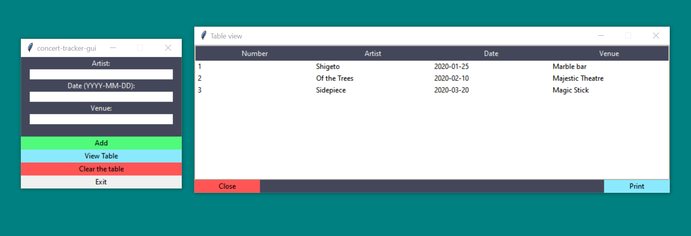

# Artist Database Builder

### Overview

I go to a lot of concerts, and was having trouble keeping track of who I have/haven't seen. I need a solution that allows me to select all the artists I have seen at a given venue, year, etc.  

Excel and Excel macros are alright, but  SQLite is better for performing queries.  
SQLite is also more relevant to my future interests and this project was a good opportunity to learn how to build a GUI in Python.

The program has an alternative command line interface and works on Windows 10 and Linux.

### Running the program

`python .\src\main.py` or download the release

### Screenshot
  

### Dependencies

* Python 3

* You need [SQLite3](https://sqlite.org/download.html) on your machine.

* [Tabulate Python module](https://github.com/astanin/python-tabulate) - which is distributed under the MIT license.  
`pip install tabulate`
* You may want a program to view the db file but it is not required. I like [sqliteonline.com](https://sqliteonline.com/) and [SQLiteStudio](https://github.com/pawelsalawa/sqlitestudio/releases).
